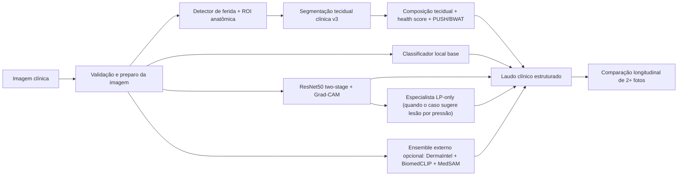

# HEAL+ / REDISUS

Plataforma de apoio ao diagnóstico e acompanhamento longitudinal de feridas, com backend clínico em Python, frontend web em Next.js e pipeline de IA para imagem médica.

[](https://github.com/pedrotescaro/redisus/actions/workflows/ci-python.yml)
[](https://github.com/pedrotescaro/redisus/actions/workflows/ci-web.yml)
[](https://github.com/pedrotescaro/redisus/actions/workflows/codeql.yml)
[](https://github.com/pedrotescaro/redisus/actions/workflows/secret-scan.yml)
[](LICENSE)


## Visão Geral

O HEAL+ / REDISUS organiza um fluxo clínico ponta a ponta para acompanhamento de pacientes com feridas:

`paciente -> lesão -> imagem -> IA -> avaliação -> evolução -> plano -> acompanhamento`

Hoje o repositório já entrega:

- cadastro e avaliação clínica;
- upload e validação real de imagens;
- delimitação manual interativa da ferida antes da IA, com suporte a uma ou mais ROIs por imagem;
- inferência com contrato padronizado de saída;
- timeline clínica por lesão;
- geração de `care plan`, `follow-up` e alertas;
- RBAC backend-first com postura zero trust;
- dashboard com fila clínica decisória;
- base para interoperabilidade clínica e exportação FHIR.

## Problema

A avaliação de feridas crônicas ainda depende muito de inspeção visual subjetiva, documentação heterogênea e baixa padronização de captura. Isso dificulta:

- rastreabilidade longitudinal;
- comparação objetiva da evolução;
- priorização clínica;
- treinamento e validação de modelos robustos;
- interoperabilidade com fluxos assistenciais reais.

## O Que Este Repositório É Hoje

Este repositório é uma base técnica séria para produto clínico e pesquisa aplicada, mas ainda não deve ser apresentado como sistema clínico pronto para produção assistencial.

O estado atual é:

- backend oficial consolidado em [`apps/api/`](apps/api/);
- domínio clínico e serviços centrais ainda concentrados em [`src/`](src/);
- wrappers estáveis em [`packages/`](packages/);
- frontend web em [`web/redisus-frontend/`](web/redisus-frontend/);
- ML e artefatos experimentais ainda em consolidação em [`ml/`](ml/), [`models/`](models/), [`dataset/`](dataset/) e [`runs/`](runs/).

## Fluxo Clínico Principal

O fluxo principal que guia o produto hoje é:

1. registrar o paciente;
2. criar a lesão;
3. associar imagem clínica;
4. rodar análise de IA;
5. registrar avaliação clínica;
6. consolidar evolução na timeline;
7. gerar ou atualizar plano de cuidado;
8. agendar acompanhamento e alertar prioridades.

Essa é a trilha mais importante do projeto neste momento. Novas features devem ficar subordinadas a esse fluxo.

## Funcionalidades Atuais

### Backend Clínico

- API oficial Flask com factory em [`apps/api/app.py`](apps/api/app.py)
- validação de payloads no backend
- upload validado por conteúdo real
- modelo de domínio com `Patient`, `Lesion`, `ClinicalImage`, `Assessment`, `InferenceResult`, `CarePlan`, `FollowUp` e `Alert`
- persistência local em SQLite
- histórico de inferência e resultado padronizado
- exportação e contratos clínicos estruturados

### IA e Análise de Imagem

- pipeline de inferência clínica em Python
- etapa manual obrigatória de ROI no analisador web, com polígono, desenho livre e círculo
- suporte a múltiplas ROIs confirmadas na mesma imagem antes da execução da pipeline
- uso da ROI manual como filtro principal para validação, segmentação, tecidos e overlays visuais
- saída padronizada com `contract_version`, `model_version` e `confidence`
- fallback para cenários sem modelo principal disponível
- suporte a experimentação com detecção, segmentação e classificação

### Gestão Clínica

- timeline clínica por lesão
- comparação temporal de evolução
- geração automática de `care plan`
- criação de `follow-up`
- alertas clínicos persistidos
- dashboard com fila decisória baseada em risco, piora, atraso e alertas

### Segurança e Governança

- backend não confia no frontend
- RBAC aplicado no backend
- perfis clínicos e pesquisador com restrições de escrita
- `.env.example` como contrato
- `firestore.rules` e `storage.rules`
- secret scanning, CodeQL, Dependabot e CI no GitHub Actions

## Tecnologias Usadas

### Backend e API

- Python
- Flask
- Flask-CORS
- Pydantic
- Loguru
- SQLite
- Requests
- Python-Dotenv

### IA, Visão Computacional e ML

- PyTorch
- TorchVision
- OpenCV
- NumPy
- Ultralytics YOLO
- segmentation-models-pytorch
- ONNX Runtime
- TensorFlow / tf2onnx
- Transformers
- OpenCLIP
- MediaPipe
- Pillow

### Frontend

- Next.js 14
- React 18
- TypeScript
- Tailwind CSS
- Firebase
- Lucide React
- jsPDF

### Interoperabilidade e Documentação Clínica

- HL7 FHIR R4 via `fhir.resources`
- contratos clínicos documentados
- dicionário de dados
- dataset card
- documentação de arquitetura e roadmap

### CI/CD e Qualidade

- GitHub Actions
- CodeQL
- Gitleaks
- Dependabot
- Pytest
- smoke tests de API e segurança

## Guia Acadêmico da IA do Projeto

Esta seção resume **como o código funciona hoje**, quais modelos de IA e redes neurais estão no repositório, de onde vieram, o que cada um explica e quais limitações precisam ser apresentadas com honestidade em contexto acadêmico.

Leitura recomendada:

- motor principal de inferência: [`src/processing/clinical_wound_analyzer_core.py`](src/processing/clinical_wound_analyzer_core.py)
- desktop que reutiliza o core: [`heal_analyzer.py`](heal_analyzer.py)
- integração do classificador LP-only ao domínio: [`src/diagnosis/clinical_ml.py`](src/diagnosis/clinical_ml.py)
- progressão longitudinal por fotos: [`src/monitoring/wound_progression.py`](src/monitoring/wound_progression.py)
- model cards locais: [`ml/model_cards/wound_classifier_v3.md`](ml/model_cards/wound_classifier_v3.md) e [`ml/model_cards/pressure_injury_stage_classifier.md`](ml/model_cards/pressure_injury_stage_classifier.md)

### Fluxo de IA e Visão Computacional



### Modelos, Redes Neurais e Heurísticas

| Componente | Status hoje | Arquitetura / tipo | Papel no sistema | Origem / artefato | Explicabilidade |
|---|---|---|---|---|---|
| Detector de ferida + ROI | Ativo | Visão computacional clássica, sem rede neural | Delimita a região da ferida, limpa fundo cirúrgico e monta a ROI de trabalho | [`src/processing/wound_detector_cv.py`](src/processing/wound_detector_cv.py) + ROI no core clínico | `detection_overlay`, contornos e máscara da ferida |
| Segmentação tecidual clínica v3 | Ativo | Regras adaptativas em HSV/LAB + textura + zonas espaciais | Estima `%` de necrose, esfacelo, granulação e epitelização | [`src/processing/clinical_wound_analyzer_core.py`](src/processing/clinical_wound_analyzer_core.py) e [`heal_analyzer.py`](heal_analyzer.py) | `segmentation_map`, `tissue_overlay`, `tissue_analysis_trace`, justificativa textual |
| Classificador local base | Ativo quando os pesos existem | EfficientNet-B0 em PyTorch/timm | Classifica 11 grupos experimentais de feridas e fornece probabilidades base para o pipeline | `models/wound_classifier_v2/wound_classifier_v2_traced.pt` + metadata em `models/wound_classifier_v2/model_metadata_v2.json` | probabilidades, `confidence`, `top-3`, contrato padronizado |
| Classificador etiológico two-stage | Ativo quando os pesos existem | ResNet50 com transfer learning (2 estágios) | Estágio 1: `Normal` vs `Wound`; Estágio 2: `Diabetic`, `Pressure`, `Venous` | [`src/diagnosis/resnet_wound_classifier.py`](src/diagnosis/resnet_wound_classifier.py) | Grad-CAM em `layer4`, entropia, margem top-2, `needs_expert_review` |
| Especialista LP-only | Ativo quando os pesos existem | ResNet50 com transfer learning + calibração par-a-par opcional | Classifica lesão por pressão em estágios I-IV e refina o diagnóstico quando a etiologia sugere LP | [`src/diagnosis/pressure_injury_stage_classifier.py`](src/diagnosis/pressure_injury_stage_classifier.py) + PIID local | `visual_signals`, `considerations`, probabilidades por estágio, margem, revisão especialista |
| Detector anatômico | Ativo quando o peso existe | MobileNetV3-Small + MediaPipe opcional | Detecta região anatômica e ajusta o contexto clínico por priors anatômicos | [`src/detection/body_part_detector.py`](src/detection/body_part_detector.py) + `models/body_part_detector.pt` | região prevista, probabilidade e priors de etiologia por região |
| Ensemble externo | Opcional | DermaIntel ViT + BiomedCLIP + MedSAM + soft voting ponderado | Reforça classificação etiológica, infecção, severidade e contorno de ferida | [`src/ai_layer/ensemble_orchestrator.py`](src/ai_layer/ensemble_orchestrator.py) | `agreement_score`, resultados individuais, `infection_risk`, `severity_index`, fusão de máscaras |
| Segmentador U-Net de tecidos | Opcional / experimental | U-Net com encoder EfficientNet-B0 | Caminho alternativo de segmentação pixel a pixel | [`src/diagnosis/tissue_segmenter.py`](src/diagnosis/tissue_segmenter.py) | máscara colorida, `tissue_percentages`, overlay |
| Progressão longitudinal | Ativo | Modelo heurístico longitudinal, não uma CNN | Compara 2 ou mais fotos da mesma ferida e estima evolução tecidual e janela de fechamento | [`src/monitoring/wound_progression.py`](src/monitoring/wound_progression.py) | deltas por tecido, trajetória, alertas, estimativa de fechamento |

### Como o Código Decide Hoje

1. O runtime principal da análise de imagem está em [`src/processing/clinical_wound_analyzer_core.py`](src/processing/clinical_wound_analyzer_core.py). O desktop em [`heal_analyzer.py`](heal_analyzer.py) reutiliza esse comportamento.
2. No fluxo web atual, a imagem pode passar primeiro por uma etapa manual de delimitação de uma ou mais feridas. Essas ROIs são serializadas no frontend, validadas pela API e convertidas em máscaras binárias reutilizáveis.
3. Quando existe ROI manual, a pipeline passa a usar a união dessas máscaras como foco principal de validação e segmentação. Isso reduz leitura de pele saudável, bordas periféricas e fundo que não pertencem à lesão.
4. A imagem passa por validação, correção opcional e detecção da região de interesse. O sistema remove fundo cirúrgico, tenta separar a ferida do entorno e cria zonas espaciais (`periferia`, `core`, `anel externo`).
5. A composição tecidual principal hoje é calculada por um pipeline clínico explicável, não por uma CNN pura. Ele considera:
   - cor em HSV e LAB;
   - textura local;
   - gradiente de borda para epitelização;
   - posição do pixel dentro da ferida;
   - tom de pele perilesional para reduzir viés na necrose;
   - exclusão de fundo cirúrgico e de pele saudável.
6. O `health_score` e as escalas PUSH/BWAT são derivados da composição tecidual e da área da ferida, servindo como apoio de triagem e monitoramento.
7. Se os pesos locais estiverem presentes, o classificador base `EfficientNet-B0` adiciona uma leitura de classes experimentais do acervo de feridas.
8. Em paralelo, o classificador `ResNet50 two-stage` gera uma leitura etiológica mais focada e produz Grad-CAM para mostrar quais regiões sustentaram a decisão.
9. Se o caso parecer lesão por pressão, o sistema pode acionar o especialista LP-only baseado em PIID para estadiamento I-IV e anexar os sinais visuais medidos.
10. Se as dependências externas e checkpoints estiverem disponíveis, o ensemble combina o modelo local com DermaIntel, BiomedCLIP e MedSAM.
11. No acompanhamento longitudinal, o sistema compara duas ou mais fotos da mesma ferida para medir mudança de área, variação da composição tecidual e estimativa de fechamento.

### O Que a IA Explica para o Usuário

O projeto não retorna apenas um rótulo. Hoje ele já expõe diferentes camadas de explicabilidade:

- **Grad-CAM** no `ResNet50 two-stage`, destacando regiões de ativação relevantes para a classe prevista.
- **`tissue_analysis_trace`** na segmentação clínica, informando cobertura classificada, porcentagem não classificada e os critérios usados para cada tecido.
- **`visual_signals`** no especialista LP-only, com proporção de vermelho, amarelo, escuro, rosa, densidade de bordas, brilho e fração da lesão.
- **margem entre top-2 classes**, entropia e flag de `needs_expert_review` nos classificadores com saída probabilística.
- **concordância do ensemble**, mostrando quando os modelos concordam ou divergem.
- **overlays visuais**: detecção, segmentação, sobreposição tecidual, Grad-CAM e comparação longitudinal.

### Dados, Treino e Artefatos

#### 1. Classificador local base (`EfficientNet-B0`)

- artefato principal: `models/wound_classifier_v2/wound_classifier_v2_traced.pt`
- metadata: `models/wound_classifier_v2/model_metadata_v2.json`
- base model: `efficientnet_b0`
- classes atuais: `11`
- fonte principal documentada: acervo público **Medetec**
- métricas registradas:
  - `accuracy = 0.6025`
  - `top-3 accuracy = 0.8484`
  - `244` amostras de validação

#### 2. Especialista LP-only (`ResNet50 + PIID`)

- artefato principal: `models/pressure_injury_stage_classifier/pressure_injury_stage_resnet50.pth`
- metadata: `models/pressure_injury_stage_classifier/model_metadata.json`
- dataset local: **PIID**
- split local atual:
  - treino: `763`
  - validação: `163`
  - teste: `165`
- baseline local registrado:
  - `validation accuracy = 0.7730`
  - `test accuracy = 0.7030`
- ponto fraco atual explicitado no projeto:
  - maior confusão entre `stage_3` e `stage_4`

#### 3. Detector anatômico (`MobileNetV3-Small`)

- artefato esperado: `models/body_part_detector.pt`
- treino com transfer learning em dataset anatômico local (`dataset/body_parts`)
- uso atual: contexto anatômico e ajuste de priors clínicos

#### 4. Modelos externos pré-treinados

- **DermaIntel ViT**: utilizado como classificador externo de feridas mapeado para a taxonomia REDISUS.
- **BiomedCLIP**: usado como modelo multimodal zero-shot para etiologia, tecido, severidade e risco de infecção.
- **MedSAM**: usado para segmentação por bounding box prompt quando o checkpoint está disponível.

Esses modelos externos **não são o mesmo que os pesos locais treinados no projeto**. Eles entram como apoio adicional ao ensemble.

### Fontes e Referências Primárias

#### Referências acadêmicas e oficiais

- He K, Zhang X, Ren S, Sun J. **Deep Residual Learning for Image Recognition** (ResNet). CVPR 2016. Disponível em: [CVF Open Access](https://www.cv-foundation.org/openaccess/content_cvpr_2016/html/He_Deep_Residual_Learning_CVPR_2016_paper.html)
- Selvaraju RR, Cogswell M, Das A, et al. **Grad-CAM: Visual Explanations from Deep Networks via Gradient-based Localization**. Disponível em: [arXiv](https://arxiv.org/abs/1610.02391)
- Howard A, Sandler M, Chu G, et al. **Searching for MobileNetV3**. Disponível em: [arXiv](https://arxiv.org/abs/1905.02244)
- Ronneberger O, Fischer P, Brox T. **U-Net: Convolutional Networks for Biomedical Image Segmentation**. Disponível em: [U-Net project page](https://lmb.informatik.uni-freiburg.de/people/ronneber/u-net/)
- Kirillov A, Mintun E, Ravi N, et al. **Segment Anything**. Disponível em: [arXiv](https://arxiv.org/abs/2304.02643)
- Ma J, He Y, Li F, et al. **Segment Anything in Medical Images (MedSAM)**. Disponível em: [Nature Communications](https://www.nature.com/articles/s41467-024-44824-z) e [GitHub oficial](https://github.com/bowang-lab/MedSAM)
- Zhang Y, Jiang J, et al. **BiomedCLIP: A Multimodal Biomedical Foundation Model Pretrained from Fifteen Million Scientific Image-Text Pairs**. Disponível em: [arXiv](https://arxiv.org/abs/2303.00915) e [Hugging Face](https://huggingface.co/microsoft/BiomedCLIP-PubMedBERT_256-vit_base_patch16_224)
- **DermaIntel Wound Classifier**. Model card oficial em: [Hugging Face](https://huggingface.co/PayamFard123/dermaintel-wound-classifier)
- **PIID - Pressure Injury Images Dataset**. Artigo relacionado em: [Springer](https://link.springer.com/article/10.1007/s00521-022-07274-6)
- **Medetec Wound Image Databases**. Fonte pública usada como base experimental em: [Medetec](https://www.medetec.co.uk/files/medetec-image-databases.html)
- **Ultralytics YOLO**. Documentação oficial em: [docs.ultralytics.com](https://docs.ultralytics.com/)

#### Referências internas do projeto

- baseline dos modelos: [ml/benchmarks/baseline_report.md](ml/benchmarks/baseline_report.md)
- model card do classificador base: [ml/model_cards/wound_classifier_v3.md](ml/model_cards/wound_classifier_v3.md)
- model card do especialista LP: [ml/model_cards/pressure_injury_stage_classifier.md](ml/model_cards/pressure_injury_stage_classifier.md)
- guia do PIID no projeto: [docs/research/piid-pressure-injury-guide.md](docs/research/piid-pressure-injury-guide.md)
- README técnico legado com detalhamento histórico: [docs/research/legacy-readme.md](docs/research/legacy-readme.md)

### Limitações Metodológicas que Devem Ser Explicadas

Para apresentação acadêmica, é importante deixar explícito que:

- este projeto é **plataforma de pesquisa aplicada e apoio à decisão**, não dispositivo médico validado para uso autônomo;
- parte dos modelos depende de pesos locais, checkpoints e dependências opcionais;
- há componentes ativos em produção experimental e outros ainda opcionais/experimentais;
- os datasets usados são heterogêneos, com desbalanceamento de classes e sem validação multicêntrica formal;
- a análise por imagem sem escala física mede área em pixels e pode sofrer com iluminação, ângulo, foco e qualidade da captura;
- a estimativa longitudinal de cicatrização é aproximada e deve ser sempre confrontada com avaliação clínica humana;
- a explicabilidade melhora a transparência do sistema, mas **não elimina erro, viés ou necessidade de revisão especializada**.

## Arquitetura Real do Repositório

```text
apps/
  api/                   backend oficial
  web/                   referência canônica em transição
  desktop/               camada desktop legada

packages/
  clinical_domain/       wrappers e contratos do domínio clínico
  ml_inference/          wrappers de inferência
  shared/                utilitários compartilhados

src/
  data/                  banco e persistência
  dashboard/             API clínica e dashboard
  diagnosis/             lógica diagnóstica
  processing/            processamento de imagem
  treatment/             apoio à conduta e cuidado

web/redisus-frontend/    frontend web em Next.js
docs/                    arquitetura, dados, produto, pesquisa e compliance
ml/                      benchmarks, model cards e relatórios
dataset/                 acervo e documentação de dados
tests/                   testes Python
artifacts/               legados, saídas e logs históricos
```

## Documentação Principal

- Arquitetura atual: [docs/architecture/system-architecture.md](docs/architecture/system-architecture.md)
- Matriz de requisitos: [docs/requirements/requirements-matrix.md](docs/requirements/requirements-matrix.md)
- Dicionário de dados: [docs/data/data-dictionary.md](docs/data/data-dictionary.md)
- Protocolo de coleta: [docs/data/collection-protocol.md](docs/data/collection-protocol.md)
- Dataset card: [docs/data/dataset-card.md](docs/data/dataset-card.md)
- Jornada do usuário: [docs/product/user-journey.md](docs/product/user-journey.md)
- Demo script: [docs/product/demo-script.md](docs/product/demo-script.md)
- Baseline de modelos: [ml/benchmarks/baseline_report.md](ml/benchmarks/baseline_report.md)
- Model card principal: [ml/model_cards/wound_classifier_v3.md](ml/model_cards/wound_classifier_v3.md)
- Segurança: [SECURITY.md](SECURITY.md)
- Roadmap: [ROADMAP.md](ROADMAP.md)
- Changelog: [CHANGELOG.md](CHANGELOG.md)

## Como Rodar Localmente

Fluxo recomendado para testar o analisador web com a etapa manual de ROI:

```powershell
python -c "from heal_web_launcher import launch_heal_analyzer_web; raise SystemExit(launch_heal_analyzer_web())"
```

Esse launcher sobe:

- backend clínico em `http://127.0.0.1:5000`
- frontend Next.js em `http://127.0.0.1:3000`
- tela do analisador em `http://127.0.0.1:3000/analyzer`
- modo local do analisador com `CLINICAL_API_REQUIRE_AUTH=0` e `NEXT_PUBLIC_HEAL_ANALYZER_LOCAL_MODE=true`

### 1. Backend oficial

```powershell
python -m venv .venv
.\.venv\Scripts\Activate.ps1
python -m pip install -r requirements.txt
copy .env.example .env
python -m apps.api.app
```

Backend oficial:

- app factory: [`apps/api/app.py`](apps/api/app.py)
- healthcheck: `GET /api/v1/health`

### 2. Frontend web

```powershell
cd web\redisus-frontend
copy .env.local.example .env.local
npm install
npm run dev
```

Observações para o analisador web:

- a etapa de delimitação manual é obrigatória antes da análise automática
- o editor suporta uma ou mais ROIs na mesma imagem
- a rota principal de teste local do fluxo atual é `/analyzer`

### 3. Variáveis de ambiente

Use [`.env.example`](.env.example) como contrato central. Não versione segredos reais.

## Testes e Verificação

### Python

```powershell
python -m pytest tests/test_clinical_api_contracts.py tests/test_api_security.py tests/test_clinical_dashboard.py -q
```

### Frontend

```powershell
cd web\redisus-frontend
npm run lint
npm run build
```

## Segurança

Itens já presentes no repositório:

- validação de autenticação e autorização no backend;
- RBAC com restrição de escrita clínica;
- validação de upload por conteúdo real;
- secret scan em CI;
- CodeQL;
- regras Firebase locais;
- arquivos de ambiente de exemplo.

Antes de produção real, ainda é necessário:

- aplicar `firestore.rules` no ambiente Firebase real;
- aplicar `storage.rules` no ambiente Firebase real;
- revisar permissões reais de acesso;
- ativar branch protection;
- fechar o processo de release.

## Licença

Este repositório está licenciado sob a [Apache License 2.0](LICENSE).

Pontos práticos da licença neste projeto:

- o código pode ser usado, modificado e redistribuído sob os termos da Apache-2.0;
- avisos de copyright e licença devem ser preservados;
- arquivos modificados devem indicar que houve alterações;
- a licença inclui concessão expressa de patentes dos contribuidores;
- a licença não concede direitos de marca sobre nomes, identidade visual ou logotipos.

Avisos adicionais do projeto estão em [NOTICE](NOTICE).

Importante:

- datasets, pesos de modelos, serviços externos e dependências de terceiros continuam sujeitos às suas próprias licenças e termos de uso;
- se a titularidade institucional do código mudar no futuro, o copyright e o `NOTICE` devem ser atualizados para refletir isso corretamente.

## Importante

- O projeto já roda e demonstra valor técnico real.
- O fluxo clínico principal está sendo fechado com prioridade máxima.
- A base ainda não representa produto clínico homologado.
- A camada de ML continua parcialmente experimental e precisa de benchmark consolidado.

## Legados Preservados

- README anterior: [docs/research/legacy-readme.md](docs/research/legacy-readme.md)
- Arquitetura anterior: [docs/architecture/platform-architecture-legacy.md](docs/architecture/platform-architecture-legacy.md)
- Guia de treino legado: [docs/research/training-guide.md](docs/research/training-guide.md)
- Artefatos antigos: [artifacts/README.md](artifacts/README.md)

## Próximos Passos

- fechar o fluxo principal clínico ponta a ponta com UX consistente;
- tornar a fila clínica acionável no dashboard;
- consolidar dataset, manifests e QA de coleta;
- fortalecer segurança de produção;
- evoluir interoperabilidade FHIR e integração SUS;
- transformar a base atual em acompanhamento longitudinal real de paciente.
