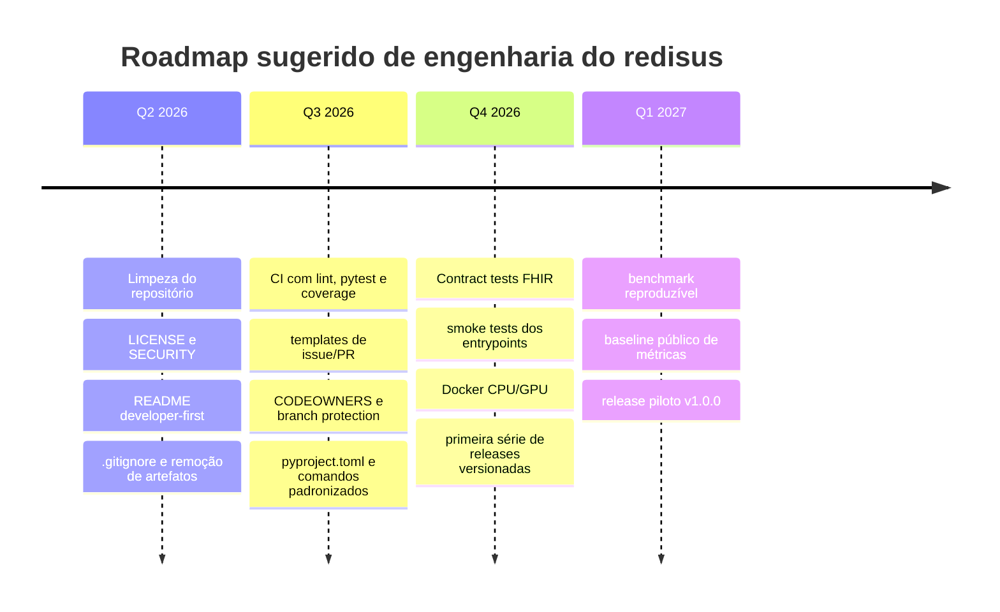
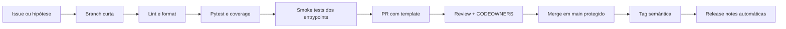

# Relatório analítico do repositório redisus e do ecossistema

## Resumo executivo

O repositório `pedrotescaro/redisus` é, na prática, um projeto de software de pesquisa aplicada em saúde digital e visão computacional para análise de feridas crônicas, não um projeto do ecossistema da entity["company","Redis","in-memory datastore company"]. A documentação pública o posiciona como HEAL+/REDISUS dentro de uma arquitetura de saúde digital integrada ao entity["organization","Sistema Único de Saúde","brazil public health"], com ênfase em YOLOv8, U-Net, ResNet50, MedSAM, PyQt6, FHIR R4 e interoperabilidade clínica. Na superfície pública auditável do repositório em entity["company","GitHub","developer platform company"], ele tem 42 commits, 1 estrela, 0 forks, 0 issues abertas, 0 PRs abertas, nenhuma release publicada e predominância de Python, embora haja também frontend em TypeScript/HTML. citeturn1view0turn22view0turn22view1turn35view2turn33view0

A boa notícia é que o projeto comunica visão, arquitetura e domínio com muita clareza. Há uma árvore modular relativamente bem desenhada em `src/`, uma suíte explícita de testes, scripts de treinamento e pré-processamento, pasta de exemplos, documentação técnica em `docs/` e um roadmap de pesquisa bastante detalhado. Em repositórios acadêmicos, isso já o coloca acima da média em organização conceitual. citeturn17view1turn17view2turn33view0turn18view0

O principal problema não é “falta de ideia”, e sim “déficit de produto e de operação”. A superfície pública do repositório indica ausência de releases, ausência de sinais públicos de CI/CD versionado, ausência aparente de arquivos de comunidade e segurança como `LICENSE`, `SECURITY.md`, `CODEOWNERS`, `ISSUE_TEMPLATE` e `PULL_REQUEST_TEMPLATE`, ausência de número de cobertura publicado e presença de artefatos que normalmente não deveriam estar rastreados em Git, como pesos (`yolov8n.pt`), logs de treinamento, banco SQLite, datasets e diretórios de execução. Isso aumenta risco jurídico, operacional, de clone pesado, de baixa reprodutibilidade e de manutenção frágil. citeturn22view0turn22view1turn23view0turn31view0turn31view1turn31view2turn31view5turn31view6turn31view7turn37view0turn37view1turn37view2turn37view3turn37view4

Em termos estratégicos, a recomendação é tratar os próximos ciclos não como “mais features clínicas”, mas como uma fase de **higiene de repositório, reprodutibilidade, governança e automação**. Antes de ampliar escopo para federated learning, mobile, RNDS e validação multicêntrica, o projeto precisa sair do estágio “bom protótipo documentado” e entrar no estágio “software auditável, instalável, testável e releaseável”. Essa ordem de prioridade é coerente com o estado atual do repositório e com as melhores práticas documentadas para CI, segurança, templates, releases, branch protection e gestão de dependências. citeturn16view0turn16view1turn16view2turn28search0turn28search2turn28search4turn28search5turn29search1turn29search4turn34search0turn34search2turn34search3turn36search0

## Escopo e método

Esta auditoria se baseia no que ficou verificável na interface pública do repositório: árvore de diretórios, README renderizado, nomes de testes e exemplos, metadados de linguagens, contagem de commits, estado de issues/PRs e seção de releases. Também usei documentação oficial de ferramentas e páginas oficiais de projetos comparáveis para propor um plano de correção e profissionalização. citeturn1view0turn22view0turn17view2turn33view0turn28search2turn29search1

Há, porém, uma limitação importante: a interface indexada permitiu auditar a estrutura e o README com bastante profundidade, mas não expôs integralmente, de forma confiável, o conteúdo bruto de alguns arquivos como `requirements.txt`, `pytest.ini` e `CONTRIBUTING.md`. Por isso, os pontos sobre dependências, setup e contribuição foram triangulados a partir do README, da árvore do projeto e dos nomes dos arquivos, e não de uma leitura byte a byte de todos os fontes. Onde houver inferência, eu a trato como inferência e não como fato executado localmente. citeturn12view1turn17view2turn33view0

## Inspeção do repositório

A estrutura do projeto é ampla e ambiciosa. No topo, aparecem pastas como `backend`, `data/protocols`, `dataset/medetec`, `design`, `docs`, `examples`, `models`, `scripts`, `src`, `tests` e `web/redisus-frontend`, além de vários entrypoints e utilitários na raiz, como `heal_analyzer.py`, `heal_platform.py`, `main.py`, `realtime_app.py` e `retrain.py`. Também há artefatos rastreados diretamente na raiz, inclusive `heal_analyzer_v1_backup.py`, diversos logs de treino (`train_*.txt`, `*_log.txt`, `*_stderr.txt`, `*_stdout.txt`) e o peso `yolov8n.pt`. Só esse quadro já sinaliza um repositório que mistura código-fonte, artefatos temporários, pesos e dados operacionais. citeturn1view0

O README é muito mais do que um guia de instalação. Ele funciona quase como um artigo técnico ou dossiê do projeto, com 20 seções cobrindo problema clínico, arquitetura, pipeline, datasets, métricas, critérios de decisão, stack, guia de execução, estrutura do projeto, roadmap de pesquisa, integração REDI-SUS, interoperabilidade com o SUS Digital, LGPD, validação clínica e referências. Além disso, o diretório `docs/` expõe `ARCHITECTURE.md` e `TRAINING_GUIDE.md`, o que é um bom sinal de preocupação documental. O custo desse formato é a fricção para o desenvolvedor novo: falta um README “developer-first”, curto, orientado a setup, execução e contribuição. citeturn35view2turn17view2

Do ponto de vista de implementação, a árvore descrita no próprio README é forte. Dentro de `src/`, há módulos para `ai_layer`, `capture`, `detection`, `processing`, `diagnosis`, `clinical`, `risk`, `treatment`, `rag`, `digital_twin`, `interoperability`, `presentation`, `training`, `data`, `utils` e `validation`. Os scripts também estão razoavelmente explícitos: scraper do Medetec, preparação de dataset YOLO, pré-processamento, augmentação médica, treino de ResNet50 two-stage, treino de YOLO e treino de U-Net. A suíte `tests/` cobre detector, classificador, análise tecidual, recomendação, RAG clínico, gêmeo digital, cliente FHIR, estratificação de risco e dashboard; e a pasta `examples/` contém demos de ensemble, detecção em tempo real e teste visual. Isso sugere um desenho modular e um início de preocupação com separação de responsabilidades. citeturn17view1turn17view2turn33view0

Em setup local, o README pede Python 3.10+, recomenda CUDA 11.8+, usa `venv` e `pip install -r requirements.txt`, descreve download e preparação de dados, treino e execução de múltiplos modos (`webcam`, `image`, `demo`, dashboard e status), além do uso de `pytest` e `pytest --cov=src --cov-report=html`. Em termos de DX, isso é bom: o caminho de uso está narrado. Em termos de maturidade, ainda é insuficiente: não há número de cobertura publicado, não há evidência pública de workflow de teste automatizado, e o próprio snippet de clone no README usa `https://github.com/SEU_USUARIO/redisus.git`, o que é inadequado para um repositório público já hospedado sob outro owner. citeturn12view1turn15view2

No plano de metadados e governança, o repositório mostra branch principal `main`, 42 commits, zero issues abertas, zero PRs abertas, nenhuma release publicada, zero packages publicados e distribuição de linguagens com Python 73,0%, TypeScript 13,0%, HTML 12,1%, JavaScript 1,1%, CSS 0,8% e PowerShell residual. A árvore principal mostra `CONTRIBUTING.md`, mas não mostra `LICENSE`, `SECURITY.md`, `CODEOWNERS`, `CODE_OF_CONDUCT`, nem templates de issue/PR. Também não há, na superfície pública indexada, menção a Ruff, mypy, Black, Codecov, CodeQL, Dependabot ou pre-commit. Em outras palavras: existe intenção de contribuição, mas ainda não existe um “sistema operacional” de manutenção comunitária e de qualidade. citeturn22view0turn22view1turn23view0turn31view0turn31view1turn31view2turn31view4turn31view5turn31view6turn31view7turn37view0turn37view1turn37view2turn37view3turn37view4

Um ponto estratégico merece destaque: apesar do nome “redisus”, a documentação pública deixa claro que o nome deriva do cluster REDI-SUS e da plataforma nacional de saúde digital integrada, não de Redis como banco ou infraestrutura. Assim, se a meta for dialogar com desenvolvedores que usam Redis, será preciso esclarecer esse desalinhamento de naming e posicionamento logo no README. Hoje, a mensagem pública é inequívoca: trata-se de um software de IA clínica, não de uma biblioteca, cliente, módulo ou integração do ecossistema Redis. citeturn35view2turn16view2

## Qualidade técnica e experiência do desenvolvedor

Pelo desenho da árvore, o projeto mostra sinais positivos de arquitetura. Há módulos explícitos para bordas de sistema — vídeo, inferência, interop, apresentação, persistência, exportação e validação — e isso tende a ser mais saudável do que concentrar tudo em um ou dois scripts de notebook. O fato de a suíte de testes nomear domínios distintos, incluindo FHIR, risco e tratamento, também sugere uma intenção de desacoplamento por capacidade de negócio. Para um software de saúde digital com IA, essa separação é uma base sólida. citeturn17view1turn33view0

Ao mesmo tempo, o repositório comunica um problema clássico de escopo excessivo. A documentação descreve uma plataforma que, ao mesmo tempo, quer ser desktop em PyQt6, dashboard web em Flask, futura API em FastAPI, pipeline de visão computacional em tempo real, segmentação profunda, explicabilidade, gêmeo digital, motor de recomendação, RAG clínico, integração FHIR, integração com e-SUS/DATASUS, aprendizado federado, mobile e validação clínica multicêntrica. Para um repositório com 42 commits e nenhuma release publicada, isso é grande demais. A avaliação aqui é direta: há mais superfície de sistema do que superfície operacional de engenharia. O risco não é “faltam ideias”; o risco é “faltam mecanismos para sustentar tanta ideia sem entropia”. citeturn35view2turn19view0turn16view0turn16view1turn16view2

Os principais pontos de falha estão nas bordas. `scripts/medetec_scraper.py` e `scripts/prepare_yolo_dataset.py` são sensíveis porque tocam aquisição de dados, scraping, pré-processamento e geração automática de labels; qualquer erro aqui contamina treinamento e métricas. `src/interoperability/fhir_client.py` é um ponto de risco alto porque lida com dados clínicos e integrações padronizadas. `src/data/database.py` merece atenção porque a própria árvore mostra um SQLite local (`data/redisus.db`) versionado, o que é péssima prática para um repositório público. `src/capture/video_stream.py` e `src/detection/realtime_detector.py` são pontos de risco de performance, concorrência e portabilidade. Já `false_positive_filter.py` e `clinical_rag.py` concentram lógica de negócio que pode gerar erro silencioso e decisão clínica incorreta se não houver boa cobertura de testes de contrato e regressão. citeturn35view0turn35view1turn33view0

A documentação define metas agressivas de mAP, Dice, AUC-ROC, FPS e latência, mas não há evidência pública de benchmark automatizado, pipeline de regressão de desempenho ou publicação contínua desses números. Então, hoje, essas métricas devem ser lidas como **metas declaradas**, não como **SLOs operacionalizados**. Para um projeto que afirma latência P95 < 30 ms em GPU e FPS ≥ 30, isso é uma lacuna relevante. Em software de IA, performance que não é medida em pipeline vira narrativa, não garantia. citeturn35view0

Em segurança e conformidade, a situação é semelhante. O README fala de LGPD, OAuth 2.0/OpenID Connect, AES-256, TLS 1.3, consentimento, anonimização e auditoria. Conceitualmente, isso é ótimo. Operacionalmente, a superfície pública do repositório não mostra política de segurança, code scanning, dependency review ou Dependabot configurados. Em um repositório de saúde digital, essa diferença entre “arquitetura declarada” e “controles verificáveis” precisa ser tratada como risco real. O estado desejado está bem descrito; o estado de engenharia ainda não está visível. citeturn18view4turn28search0turn28search4turn34search3turn37view1

A experiência do desenvolvedor é “boa no papel, irregular na prática”. É positiva porque o README ensina a criar ambiente virtual, instalar dependências, baixar dados, treinar modelos e executar demos. É irregular porque não há indícios públicos de `pyproject.toml`, `setup.py`, `Makefile` ou `Dockerfile`, o que reduz padronização e automação; porque o comando de clone no README está parametrizado inadequadamente; e porque o repositório mistura dados, modelos e logs em uma só superfície, o que costuma degradar tempo de clone, revisão e confiabilidade do histórico. Para um novo colaborador, o setup parece possível; para um mantenedor, ainda não parece confortável. citeturn12view1turn22view1turn32view0turn32view1turn32view3turn32view4turn32view5

## Ecossistema, alternativas e melhores práticas

O ecossistema imediato do projeto é o da rede REDI-SUS, não o de Redis. O README o conecta a módulos como DermaSUS, TAKERE, Twin@Home e REDE VIVA, com uma camada de interoperabilidade baseada em Gateway FHIR R4, e-SUS PEC, RNDS e DATASUS/SIGTAP. Em outras palavras, trata-se mais de uma plataforma clínica federada do que de um repositório isolado de visão computacional. Essa leitura muda a comparação correta: o benchmark não é `redis-py` ou `node-redis`, mas sim plataformas e frameworks de imaging médico, segmentação e interoperabilidade clínica. citeturn18view2turn19view5turn16view2

Entre as alternativas mais úteis para comparar maturidade e prática de engenharia, destacam-se o ecossistema de entity["organization","Project MONAI","healthcare imaging ai"], o viewer da entity["organization","Open Health Imaging Foundation","medical imaging foundation"], projetos de segmentação de feridas já focados no problema e plataformas médicas extensíveis como 3D Slicer. O ponto importante aqui é que essas alternativas não são substitutos 1:1; elas são referências em camadas diferentes do stack. citeturn27search7turn26search2turn27search4turn26search1turn26search0

| Projeto / alternativa | Camada comparável | O que a solução oficial mostra de forte | O que isso expõe no redisus | Prática que vale absorver | Fonte oficial |
|---|---|---|---|---|---|
| `uwm-bigdata/wound-segmentation` | baseline direto de segmentação de feridas | Escopo enxuto, reprodutível, com foco claro em segmentação e dataset, requisitos explícitos e comandos simples de treino/predição | O redisus é muito mais ambicioso, mas menos enxuto como “benchmark reproduzível” | Criar um track mínimo e reproduzível de benchmark para segmentação e classificação | citeturn26search1 |
| `bowang-lab/MedSAM` | segmentação médica fundacional | Instalação objetiva, licença explícita, release publicada, GUI, inferência e treino claramente separados | O redisus cita MedSAM, mas não apresenta o mesmo nível de encapsulamento operacional na superfície pública | Isolar inferência, checkpoints e instruções de execução em trilhas mais claras | citeturn26search0turn26search3 |
| `Project-MONAI/MONAI` | framework de IA para imaging em saúde | Repositório maduro, testes, docs, múltiplos workflows, comunidade e especialização em imaging clínico | O redisus tem boa narrativa de domínio, mas ainda não tem o arcabouço de tooling e governança de um framework | Adotar padrão de tooling, lint, testes, bundles e contratos mais formais | citeturn27search7turn27search11 |
| `OHIF/Viewers` | camada de visualização clínica web | Extensibilidade, PWA, OpenID Connect, DICOMweb, segmentação, releases frequentes e forte foco em experiência do usuário | O frontend do redisus existe, mas a experiência de distribuição e o modelo de extensão não estão claros | Separar melhor a camada clínica/frontend e formalizar contratos de integração | citeturn26search2turn26search7 |
| `Slicer/Slicer` e 3D Slicer | desktop/plataforma extensível médica | Ecossistema com extensões, documentação de build, contribuidores, releases/tags e orientação clara para pesquisa e produto | O redisus tem ambição parecida de desktop + extensões, mas sem o mesmo nível de convenções públicas | Investir em extensibilidade formal, guias de build e governança de contribuições | citeturn27search4turn27search6 |

A síntese das melhores práticas é bastante clara. Repositórios maduros desse espaço tendem a fazer quatro coisas bem: **delimitam escopo**, **separam artefatos de código**, **formalizam contratos de contribuição** e **automatizam qualidade e release**. As recomendações do próprio GitHub para `CONTRIBUTING.md`, templates de issue/PR, `CODEOWNERS`, branch protection, checks obrigatórios e releases gerados automaticamente seguem exatamente nessa direção. Para o redisus, a distância principal para os pares maduros não está só no modelo de IA, mas no ritual de engenharia em volta dele. citeturn13search7turn28search5turn34search0turn34search2turn29search1turn29search4

## Roadmap, backlog e plano de releases

O roadmap atual do projeto é forte como plano de pesquisa. O README organiza 24 meses em T1–T8, conecta entregas a pacotes de trabalho e faz um bom acoplamento entre requisitos, coleta, IA, interoperabilidade, usabilidade e validação clínica. Isso é bom para captação, alinhamento institucional e visão de longo prazo. O problema é que esse roadmap quase não explicita milestones de engenharia de software: limpeza do repositório, semver, licenciamento, gates de CI, cobertura mínima, contrato de API, política de segurança, estratégia de checkpoints e empacotamento. Essas lacunas precisam entrar no backlog como first-class citizen. citeturn16view3turn18view0turn18view1

### Backlog priorizado com esforço e impacto

| Prioridade | Item | Evidência do estado atual | Esforço | Impacto | Entregável |
|---|---|---|---|---|---|
| P0 | Higiene legal e de artefatos | Há badge de licença, mas não há `LICENSE` visível; há logs, peso `.pt`, SQLite, datasets e diretórios de execução na árvore. citeturn23view0turn1view0turn33view0 | Baixo | Alto | `LICENSE`, `.gitignore` saneado, artefatos removidos do versionamento |
| P0 | CI mínima para lint, testes e cobertura | O README ensina `pytest --cov`, mas não há evidência pública de workflow em `.github/workflows`, Codecov, CodeQL ou Dependabot. citeturn15view2turn22view1turn31view5turn31view6turn31view7 | Médio | Alto | workflow `ci.yml`, relatório de cobertura, checks obrigatórios |
| P0 | README developer-first | README atual é excelente como dossiê, mas excessivo para onboarding; o clone URL usa placeholder `SEU_USUARIO`. citeturn35view2turn12view1 | Baixo | Alto | README curto com quickstart + links para docs |
| P1 | Empacotamento e reprodutibilidade | Não há indício público de `pyproject.toml`, `Makefile` ou lockfile; o setup depende de `requirements.txt` sem auditoria pública do conteúdo. citeturn22view1turn32view3turn32view5 | Médio | Alto | `pyproject.toml`, `requirements-dev.txt`, comandos padronizados |
| P1 | Contratos de contribuição e triagem | Existe `CONTRIBUTING.md`, mas não há sinais públicos de `CODEOWNERS`, `SECURITY.md` ou templates de issue/PR. citeturn1view0turn37view0turn37view1turn37view3turn37view4 | Baixo | Alto | templates, policy de segurança, donos por diretório |
| P1 | Testes de integração clínica e de dados | Há testes por módulo, mas não aparecem testes nomeados para scraper, pipeline E2E, banco, CLI dos entrypoints ou benchmark de latência. citeturn33view0 | Médio | Alto | smoke tests, contract tests FHIR, testes de pipeline |
| P2 | Release management e changelog | Não há releases publicadas; também não há `CHANGELOG.md` visível. citeturn22view0turn22view1turn16view5 | Baixo | Médio | tags semânticas, notas automáticas, changelog |
| P2 | Containerização e perfis de execução | Docker aparece no roadmap de escalabilidade, mas não como ativo verificável na árvore. citeturn32view0turn32view1 | Médio | Médio | `Dockerfile`, `docker-compose.yaml`, imagem CPU e GPU |

A visualização abaixo transforma o roadmap institucional em um roadmap de engenharia mais executável. Ela é coerente com o estado atual do repositório e com as práticas recomendadas para templates, proteção de branch, checks obrigatórios e releases automatizados. citeturn28search5turn34search0turn29search1turn29search4turn36search0



O fluxo de contribuição também precisa sair do implícito e virar trilha operacional. Abaixo está o fluxo recomendado para o projeto. citeturn13search7turn28search5turn34search0turn34search2



### Plano de releases e milestones sugeridos

| Release | Objetivo | Critério de saída | Janela sugerida |
|---|---|---|---|
| `v0.1.0` | Base de governança e limpeza | `LICENSE`, `SECURITY.md`, `.gitignore`, remoção de artefatos rastreados, README curto de instalação | Q2 2026 |
| `v0.2.0` | Reprodutibilidade e CI | workflow de CI funcionando, lint, pytest, coverage em HTML/XML, templates de issue/PR, `CODEOWNERS` | Q3 2026 |
| `v0.3.0` | Integração e benchmark | smoke tests dos entrypoints, contrato FHIR, benchmark mínimo reproduzível para detector/segmentador | Q4 2026 |
| `v1.0.0` | Piloto técnico confiável | semver formal, changelog, Docker CPU/GPU, releases assinadas, documentação de operação e matriz de ambientes | Q1 2027 |

Essa sequência usa o espírito do versionamento semântico: `0.y.z` enquanto o projeto ainda está em rápida estabilização de API, processo e distribuição; `1.0.0` apenas quando houver um contrato público relativamente estável para instalação, execução e consumo. citeturn36search0turn29search3

## Riscos, métricas, automações e patches sugeridos

Os riscos principais do projeto não são apenas “bugs”. São riscos de **continuidade**, **reprodutibilidade**, **compliance**, **reviewability** e **operabilidade**. Um repositório de saúde digital com SQLite local versionado, logs de treinamento rastreados e sem política pública de segurança ou automação visível corre o risco de virar difícil de auditar exatamente quando começar a ser mais usado. Ao mesmo tempo, a ausência de releases e de changelog dificulta qualquer tentativa séria de pilotagem clínica ou colaboração externa. citeturn33view0turn22view0turn37view1

As automações prioritárias são bem conhecidas e têm suporte oficial robusto: workflow de Python no GitHub Actions para build e testes; code scanning com CodeQL; dependency review; Dependabot para atualizar dependências e actions; branch protection com status checks obrigatórios; `CODEOWNERS`; templates de issue/PR; e release notes automáticas. Para cobertura, a combinação `pytest-cov` + `coverage.py` com branch coverage resolve a parte básica. Para lint/format e typing, Ruff e mypy são escolhas práticas e amplamente adotadas. citeturn28search2turn28search4turn28search0turn34search3turn34search0turn34search2turn28search5turn29search4turn30search6turn30search7turn30search0turn30search2turn30search10

### Métricas recomendadas

As métricas que eu adotaria desde já são: taxa de sucesso da CI; cobertura de statements e branch coverage no `src/`; tempo de execução dos smoke tests dos entrypoints; latência P95 e throughput do modo `webcam` em perfil CPU e GPU; taxa de falha dos testes de contrato FHIR; lead time de PR; idade média de dependências; número de artefatos binários rastreados em Git; e cadência de release. Isso dá visibilidade tanto para qualidade interna quanto para maturidade operacional. citeturn30search6turn30search7turn28search2turn34search3turn29search3

### Checklist de entrega

| Item | Critério de aceite | Dono sugerido | Prioridade |
|---|---|---|---|
| `LICENSE` explícita | arquivo na raiz e badge coerente | mantenedor principal | P0 |
| Limpeza de artefatos | sem logs, pesos, DB e datasets rastreados por padrão | mantenedor principal | P0 |
| CI Python | PR falha se lint/teste/cobertura falharem | dev backend | P0 |
| Coverage report | XML + HTML gerados em CI, com branch coverage habilitada | dev backend | P0 |
| Templates de issue/PR | abertura de issue/PR padronizada | maintainer/community | P1 |
| `SECURITY.md` + Dependabot | política de reporte e updates automáticos | maintainer/security | P1 |
| `CODEOWNERS` + branch protection | review obrigatório por área | maintainer | P1 |
| `pyproject.toml` ou manifesto equivalente | comandos padronizados de lint/test/typecheck/test | dev backend | P1 |
| Smoke tests | `main.py`, `heal_platform.py` e `realtime_app.py` validáveis em CI | dev backend | P1 |
| Primeira release `v0.1.0` | tag, notas e changelog publicados | maintainer | P2 |

### Arquivos e trechos que precisam de correção com patches ou comandos sugeridos

Os patches abaixo atacam os problemas de mais alta confiança observados na árvore pública: clone URL incorreto no README, artefatos versionados, ausência de CI e ausência de automação de dependências. A ideia aqui não é fingir acesso integral aos fontes, e sim oferecer mudanças seguras, de baixo arrependimento, e alinhadas ao estado observável do projeto. citeturn12view1turn1view0turn22view0turn31view6turn34search3

**Patch para `README.md` focado em onboarding**

```diff
diff --git a/README.md b/README.md
@@
-# 1. Clonar o repositório
-git clone https://github.com/SEU_USUARIO/redisus.git
+# 1. Clonar o repositório
+git clone https://github.com/pedrotescaro/redisus.git
 cd redisus
@@
-# 3. Ativar ambiente virtual
-# Windows PowerShell:
-.\.venv\Scripts\Activate.ps1
-# Linux/macOS:
-source .venv/bin/activate
+# 3. Ativar ambiente virtual
+# Windows PowerShell
+.\.venv\Scripts\Activate.ps1
+# Linux/macOS
+source .venv/bin/activate
@@
-# Executar suite de testes
+# Executar a suíte de testes
 pytest
@@
-# Testes com cobertura
-pytest --cov=src --cov-report=html
+# Testes com cobertura
+pytest --cov=src --cov-report=term-missing --cov-report=html --cov-report=xml
```

**Patch para `.gitignore` visando higiene de repositório**

```diff
diff --git a/.gitignore b/.gitignore
@@
+# ambientes
+.venv/
+venv/
+__pycache__/
+.pytest_cache/
+.mypy_cache/
+.ruff_cache/
+.coverage
+coverage.xml
+htmlcov/
+
+# artefatos de treino e execução
+runs/
+*.pt
+*.onnx
+*.log
+*_log.txt
+*_stderr.txt
+*_stdout.txt
+download_done.txt
+
+# dados locais
+data/*.db
+dataset/
+models/
+
+# frontend
+web/redisus-frontend/node_modules/
+web/redisus-frontend/dist/
```

**Workflow mínimo de CI em `.github/workflows/ci.yml`**

```yaml
name: ci

on:
  push:
    branches: [main]
  pull_request:

jobs:
  test:
    runs-on: ubuntu-latest
    strategy:
      matrix:
        python-version: ["3.10", "3.11"]

    steps:
      - uses: actions/checkout@v5

      - uses: actions/setup-python@v5
        with:
          python-version: ${{ matrix.python-version }}

      - name: Install system deps
        run: |
          sudo apt-get update
          sudo apt-get install -y libgl1

      - name: Install Python deps
        run: |
          python -m pip install --upgrade pip
          pip install -r requirements.txt
          pip install pytest pytest-cov ruff mypy

      - name: Lint
        run: ruff check .

      - name: Format check
        run: ruff format --check .

      - name: Type check
        run: mypy src || true

      - name: Test
        run: pytest --cov=src --cov-report=term-missing --cov-report=xml

      - name: Upload coverage xml
        uses: actions/upload-artifact@v4
        with:
          name: coverage-xml-${{ matrix.python-version }}
          path: coverage.xml
```

**Configuração mínima de Dependabot em `.github/dependabot.yml`**

```yaml
version: 2
updates:
  - package-ecosystem: "pip"
    directory: "/"
    schedule:
      interval: "weekly"
  - package-ecosystem: "github-actions"
    directory: "/"
    schedule:
      interval: "weekly"
```

**Comandos Git para remover artefatos já rastreados**

```bash
git rm --cached -r runs dataset models data/*.db || true
git rm --cached *.pt *.log *_log.txt *_stderr.txt *_stdout.txt download_done.txt || true
git commit -m "chore(repo): stop tracking generated artifacts and local datasets"
```

Se o histórico já estiver muito poluído por binários e datasets, vale considerar uma limpeza de histórico com `git filter-repo`, mas eu recomendaria fazer isso só depois de congelar a branch principal e comunicar claramente a reescrita de histórico para qualquer colaborador. Em paralelo, checkpoints e datasets deveriam migrar para um registry de modelos, storage externo ou release assets versionados, e não permanecer versionados diretamente na árvore principal. Essa recomendação é coerente com as práticas documentadas do GitHub para releases, com as regras de versionamento semântico e com o fato de que o repositório hoje não publica releases. citeturn29search1turn29search3turn36search0turn22view0

Há também três correções conceituais que eu colocaria imediatamente no backlog, ainda que sem patch exato por limitação de leitura bruta do código: refatorar os múltiplos launchers de raiz para uma CLI mais unificada; formalizar testes de contrato para `src/interoperability/fhir_client.py`; e separar “código de pesquisa”, “código de produto” e “artefatos de experimento” em superfícies distintas. Esses três movimentos reduziriam complexidade acidental, melhorariam DX e deixariam o projeto mais auditável para uso institucional. citeturn17view1turn33view0

Por fim, a maior limitação aberta desta auditoria é simples: a estrutura e a documentação pública permitiram concluir bastante coisa sobre organização, governança e prontidão operacional, mas não permitiram validar linha a linha o conteúdo atual de `requirements.txt`, `pytest.ini`, `CONTRIBUTING.md` e todos os módulos Python. Portanto, o diagnóstico sobre arquitetura e processo é de alta confiança; já o diagnóstico sobre detalhes finos de implementação deve ser lido como “forte evidência estrutural + inferência prudente”, não como execução local integral do projeto. Ainda assim, isso não muda a conclusão central do relatório: o redisus já tem visão, domínio e estrutura; o gargalo agora é profissionalização do repositório.